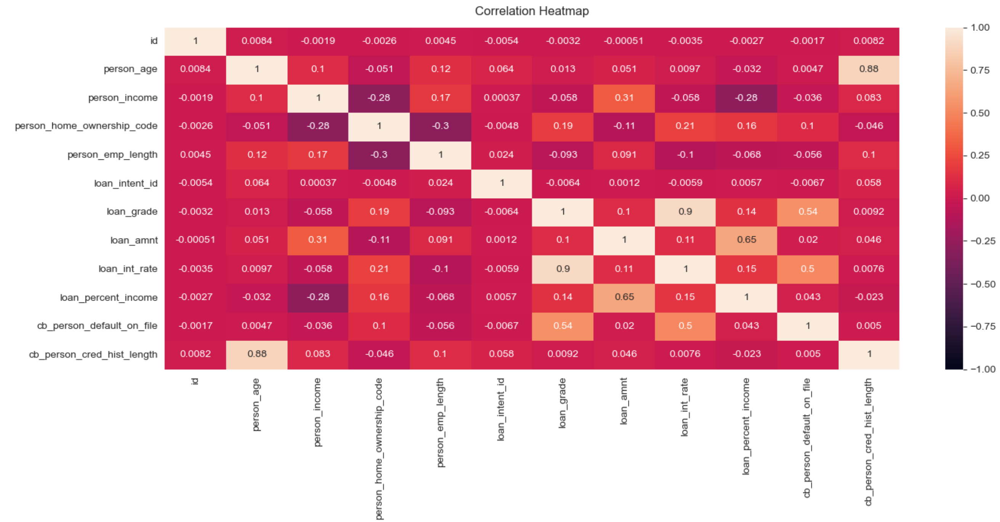
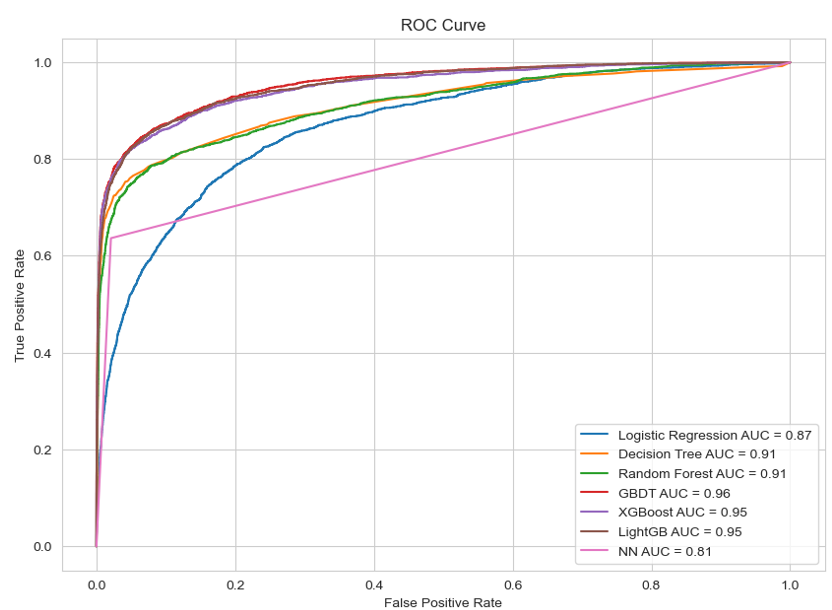

# Loan Default Prediction Using Machine Learning

Predicting loan default risk using multiple machine learning models and comparing their predictive performance, efficiency, and interpretability.

---

## Project Overview

This project develops and evaluates multiple machine learning models to predict whether a borrower is likely to default on a loan. The objective is to identify high-risk applicants and support data-driven lending decisions.

The project demonstrates an end-to-end machine learning workflow, including:

- Data preprocessing
- Exploratory Data Analysis (EDA)
- Feature engineering
- Model training
- Hyperparameter tuning
- Cross-validation
- Model comparison
- Model interpretation using SHAP

---

## Business Problem

Loan default prediction is a binary classification problem commonly encountered in the financial industry.

Accurately identifying borrowers with a high probability of default enables financial institutions to:

- Reduce credit risk
- Improve loan approval decisions
- Minimize financial losses
- Enhance risk management strategies

---

## Dataset

**Source**

Kaggle Playground Series – Season 4 Episode 10

**Competition**

Loan Default Prediction

https://www.kaggle.com/competitions/playground-series-s4e10

**Target Variable**

- loan_status

---

## Technologies

### Programming Language

- Python

### Libraries

- Pandas
- NumPy
- Matplotlib
- Seaborn
- Scikit-learn
- TensorFlow / Keras
- XGBoost
- LightGBM
- SHAP

---

# Project Workflow

## 1. Data Preprocessing

- Loaded and inspected the dataset
- Checked missing values
- Verified data types
- Removed invalid records (e.g., applicants who started working before age 14)
- Encoded categorical variables

---

## 2. Exploratory Data Analysis

Performed exploratory data analysis to better understand feature distributions and relationships.

Main analyses include:

- Boxplots for outlier detection
- Correlation analysis
- Correlation heatmap
- Feature distribution visualization

Since **loan_int_rate** showed a very high correlation with **loan_grade**, it was removed to reduce multicollinearity before model training.

### Correlation Heatmap



---

## 3. Model Development

The following machine learning models were trained and compared:

- Logistic Regression
- Decision Tree
- Random Forest
- Gradient Boosting Decision Tree (GBDT)
- XGBoost
- LightGBM
- Neural Network (TensorFlow)

Model optimization includes:

- Hyperparameter tuning
- Grid Search
- 5-Fold Cross Validation

---

# Model Performance

| Model | Training Accuracy | Test Accuracy |
|------|------------------:|--------------:|
| Logistic Regression | 89.12% | 89.45% |
| Decision Tree | 94.43% | 94.13% |
| Random Forest | 92.67% | 93.09% |
| GBDT | 95.82% | **95.08%** |
| XGBoost | **96.31%** | 95.00% |
| LightGBM | 95.07% | 94.72% |
| Neural Network | - | 93.26% |

---

# Classification Metrics

| Model | Precision | Recall | F1 Score | ROC-AUC |
|------|----------:|--------:|---------:|--------:|
| Logistic Regression | 74.34% | 38.53% | 50.76% | 0.87 |
| Decision Tree | 87.10% | 68.56% | 76.73% | 0.92 |
| Random Forest | 91.58% | 56.15% | 69.62% | 0.91 |
| GBDT | **90.72%** | **72.51%** | **80.60%** | **0.96** |
| XGBoost | 90.45% | 72.19% | 80.30% | 0.95 |
| LightGBM | 88.72% | 71.66% | 79.29% | 0.95 |
| Neural Network | 84.32% | 64.17% | 72.88% | - |

---

# Runtime Comparison

| Model | Runtime (seconds) |
|------|------------------:|
| Decision Tree | **0.051** |
| LightGBM | 0.081 |
| XGBoost | 0.197 |
| Logistic Regression | 0.243 |
| Random Forest | 1.025 |
| GBDT | 5.376 |
| Neural Network | 105.368 |

---

## ROC Curve Comparison

The ROC curves compare the predictive performance of all machine learning models.

GBDT achieved the highest ROC-AUC (0.96), while XGBoost and LightGBM produced comparable performance with significantly shorter training times.



---

# Key Findings

- Ensemble learning methods consistently outperformed traditional machine learning models.
- GBDT achieved the highest overall predictive performance with **95.08%** testing accuracy and **80.60%** F1-score.
- XGBoost achieved nearly identical performance while requiring substantially less training time.
- LightGBM was the fastest ensemble model and maintained competitive predictive performance.
- Correlation analysis and feature selection helped reduce multicollinearity before model training.
- SHAP was applied to improve model interpretability and explain feature importance.

---

# Repository Structure

```
Loan-Default-Prediction
│
├── README.md
├── Final_Project.ipynb
├── Final_Project.html
├── train.csv
├── requirements.txt
│
├── images
│   ├── correlation_heatmap.png
│   └── roc_curve.png
│
└── models
```

---

# Future Improvements

- Address class imbalance using SMOTE or class weighting
- Bayesian hyperparameter optimization
- Deploy the best-performing model with Streamlit
- Build an interactive dashboard for loan default prediction

---

# Author

**Chenyin Luo**

M.S. in Data Analytics  
Tufts University

GitHub: https://github.com/chenyin9808
